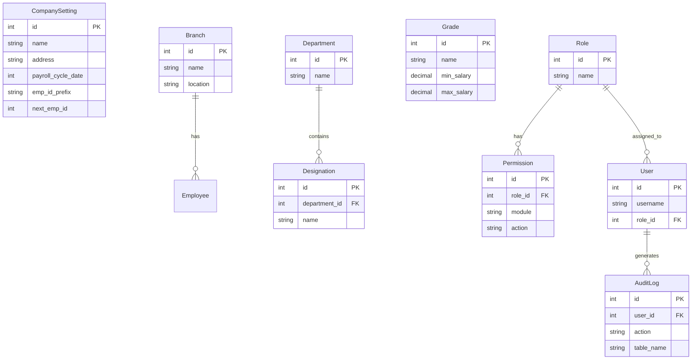
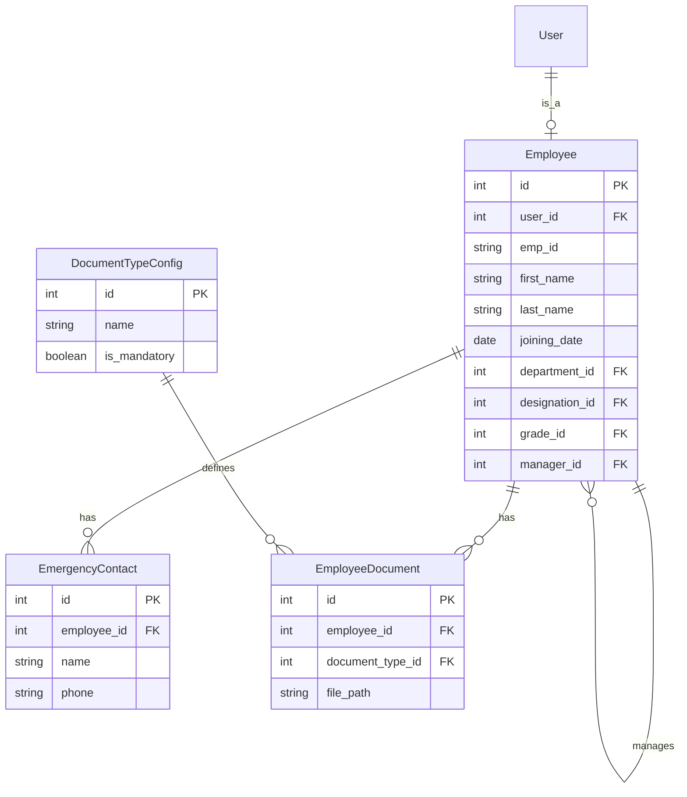
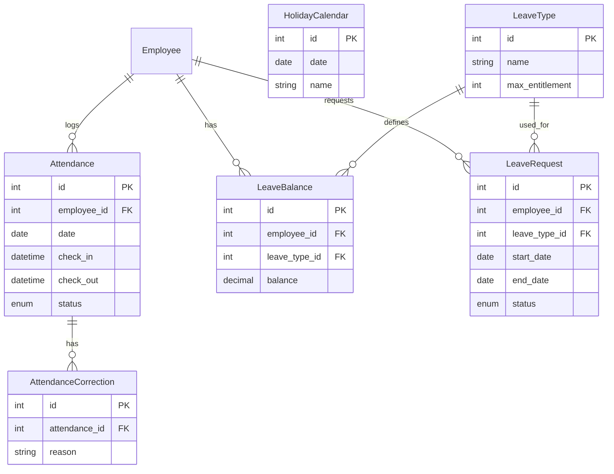
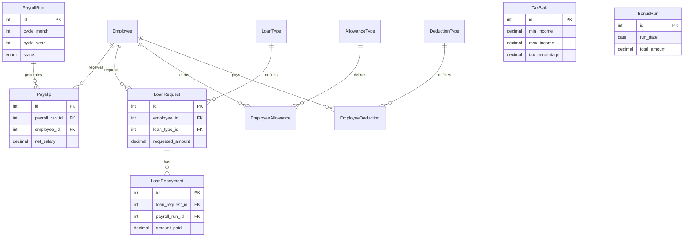

# Database Design & Entity Relationship Diagrams

This document outlines the database schema for the HR & Payroll System. The system contains over 30 tables, which are logically grouped by module below.

## 1. Organization & Security Module
This module handles company settings, branches, departments, designations, roles, permissions, and user access.

## 2. Employee Module
This module is the core of the workforce data, linking users to their employment records, emergency contacts, and documents.

## 3. Attendance & Leave Module
Tracks daily check-ins, holiday calendars, overtime, and leave balances/requests.

## 4. Compensation, Loans & Payroll Module
Handles allowances, deductions, taxes, loans, bonuses, and the final monthly payroll runs.

